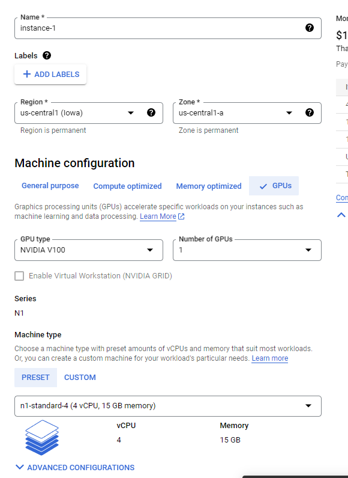
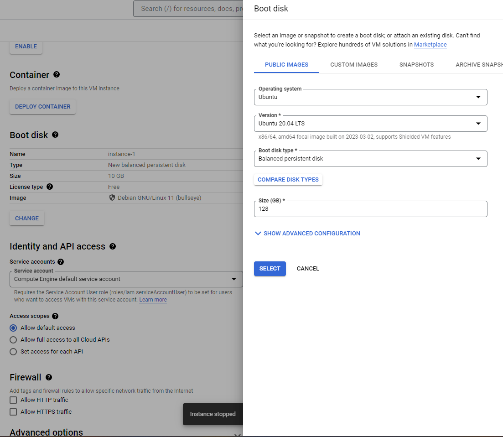

# Ubuntu and Docker setup on GCP

Steps to set up the development environment on a GPU powered VM instance on Google Cloud for this project.

# 1. VM instance config

#### 1.1 machine configurations:
  - check 'GPUs'. 
  - GPU type: 
    - NVIDIA V100 (or another of your choice)
    - Number of GPUs: 1
  - machine type: 
    - n1-standard-4 (4 vCPU, 15 GB memory)
  - display device: 
    - check 'enable display device'
  - boot disk: 
    - operating system: Ubuntu. 
    - version: Ubuntu 20.04 LTS (x86/64)
    - size: 128GB.

leave the rest of the setting as is. Then click 'CREATE'.

 
 

#### 1.2 Docker Installation
ref: https://medium.com/@kevindanikowski/create-gpu-attached-vm-with-docker-container-on-google-cloud-platform-91dbce469a14
ref: https://docs.docker.com/engine/install/ubuntu/

  - Step 1: ssh to VM. 
    - when the VM is running, simply click the 'SSH' to open up a terminal in browser.
    - sudo su
    - apt update
      - apt install ubuntu-drivers-common   ### install ubuntu common drivers
      - ubuntu-drivers devices    ### check GPU is available
    - sudo ubuntu-drivers autoinstall
    - when install finishes, run 'nvidia-smi' to check if it shows akk details of Cuda installed on the VM
  - Step2: Docker Installation: 
    - sudo apt-get update
    - sudo apt-get install \\
    ca-certificates \\
    curl \\
    gnupg
    - sudo mkdir -m 0755 -p /etc/apt/keyrings
    - curl -fsSL https://download.docker.com/linux/ubuntu/gpg | sudo gpg --dearmor -o /etc/apt/keyrings/docker.gpg
    - echo \\
  "deb [arch="$(dpkg --print-architecture)" signed-by=/etc/apt/keyrings/docker.gpg] https://download.docker.com/linux/ubuntu \\
  "$(. /etc/os-release && echo "$VERSION_CODENAME")" stable" | \\
  sudo tee /etc/apt/sources.list.d/docker.list > /dev/null
    - sudo apt-get update
    - sudo apt-get install docker-ce docker-ce-cli containerd.io docker-buildx-plugin docker-compose-plugin
  - Step3 Installation of Nvidia Docker: 
    - curl -s -L https://nvidia.github.io/nvidia-docker/gpgkey | sudo apt-key add -
    - distribution=$(. /etc/os-release;echo $ID$VERSION_ID)
    - curl -s -L https://nvidia.github.io/nvidia-docker/$distribution/nvidia-docker.list | sudo tee /etc/apt/sources.list.d/nvidia-docker.list
    - sudo apt-get update
    - sudo apt-get install -y nvidia-docker2
    - service docker restart
  - Step 4 Login to Docker to Pull Containers: 
    - use the commands in the top answer here: https://stackoverflow.com/questions/59872307/gcp-unable-to-pull-docker-images-from-our-gcp-private-container-registry-on-ubu
      after download the .gz file:
      1. mkdir /usr/bin/docker-credential-gcloud
      2. tar -xvzf ./docker-credential-gcr_linux_amd64-2.0.0.tar.gz -C /usr/bin/docker-credential-gcloud
      3. sudo chmod +x /usr/bin/docker-credential-gcloud
      4. gcloud auth print-access-token | docker login -u oauth2accesstoken --password-stdin https://gcr.io

#### 1.3 Create GPU Attached Docker Container
  - Step 1: 
    - under home dir, create project dir. Here I am using /home/airlay88/projects/cs7643-final (called PATH in the following sections)
  - Step 2 :
    - cd to PATH, git clone the repo: https://github.com/Kharasso/PointPillars-cs7643
  - Step 3:
    - download the nvidia cuda docker image and start the container using the following command:
    docker run -d -it --gpus=all --name cs7643 -h cs7643 --volume "PATH":/cs7643 --entrypoint bash nvidia/cuda:11.7.0-cudnn8-devel-ubuntu20.04

**** After that, you will see a hash. You can then run 'docker attach {HASH}' to go to the container.
Whenver you stop the VM and restart, the container is stopped as well. So every time you restart the VM, after SSH to it, you should run 'docker container restart {HASH}' to restart it before running 'docker attach {HASH}' to go to the container.
If you forget the hash, you can run 'docker container ls -a' to display it. ****
**** if you are not able to run the docker commands and see permissions denied error, it is because the docker was setup running as su, instead of the user. Run 'sudo su' to go into su mode will solve the permissions issue ****

